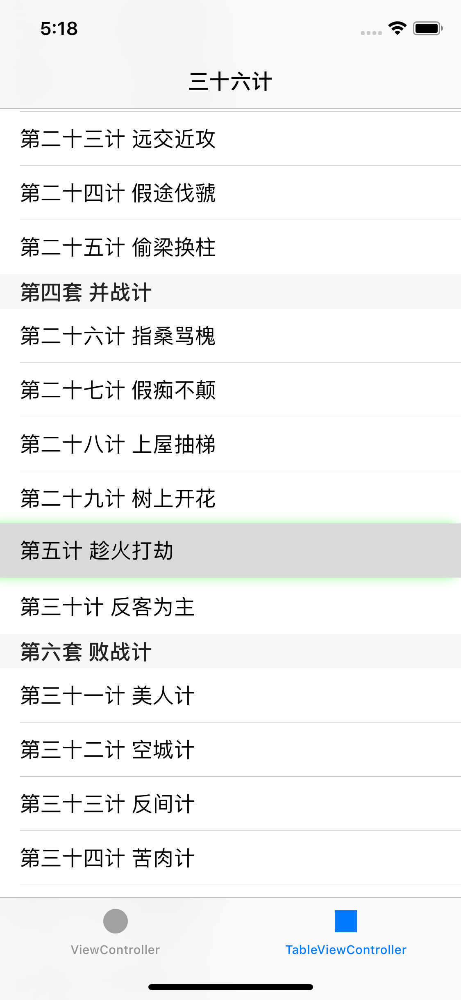

# MoveableCell
Long press to Moveable TableView Cell


第3个应用是 *长按移动Cell*

源码: <https://github.com/iOSDevLog/1Day1App>



## 原理
---

为UITableView添加一个长按手势，然后给选中的 *cell*截图；让截图随着手势移动，同时记录选中的indexPath，方便位置互换。

> **IDL** 为 *iOSDevLog* 简写

## 定义接口
---

* 定义接口 `IDLMoveableCellTableViewDataSource`

```swift
@objc protocol IDLMoveableCellTableViewDataSource  {
    // original datasource
    func dataSourceArray(in tableView: UITableView) -> [Any]
    
    // exchanged datasource
    func tableView(_ tableView: UITableView, newDataSourceArrayAfterMove newDataSourceArray: [Any])
}
```

* 定义接口 `IDLMoveableCellTableViewDelegate`

```swift
@objc protocol IDLMoveableCellTableViewDelegate {
    func tableView(_ tableView: UITableView, willMoveCellAt indexPath: IndexPath)
    func tableView(_ tableView: UITableView, didMoveCellFrom fromIndexPath: IndexPath, to toIndexPath: IndexPath)
    func tableView(_ tableView: UITableView, endMoveCellAt indexPath: IndexPath)
    func tableView(_ tableView: UITableView, drawMovealbeCell: UIView)
}
```

# 扩展 UITableView
---

```swift
@IBDesignable extension UITableView { }
```

* @IBInspectable

用 @IBInspectable 修饰的属性会显示在 IB 的 Show the Attributes inspector。

```
extension UIView {
    private struct AssociatedKeys {
        static var name: String?
    }
    
    // 存储属性
    @IBInspectable var name: String {
        get {
            return objc_getAssociatedObject(self, &AssociatedKeys.name) as! String
        }
        set {
            objc_setAssociatedObject(self, &AssociatedKeys.name, newValue, .OBJC_ASSOCIATION_RETAIN)
        }
    }
    
    
    // 计算属性
    @IBInspectable var borderColor: UIColor {
        set {
            self.layer.borderColor = newValue.cgColor
        }
        get {
            return UIColor.init(cgColor: self.layer.borderColor!)
        }
    }
}
```

* 在`struct`中定义常量

```swift
    private struct IDLConstraint {
        static let kIDLMoveableCellAnimationTime: TimeInterval = 0.25
        static let kIDLMinimumPressDuration: CFTimeInterval = 0.2
    }
    
    private struct IDLAssociatedKeys {
        static var iDLDataSourceName: String?
        static var iDLMoveableDelegateName: String?
        static var iDLGestureMinimumPressDurationName: String?
        static var iDLGestureName: String?
        static var iDLTempViewName: String?
        static var iDLEdgeScrollTimerName: String?
        static var iDLSelectedIndexPathName: String?
        static var iDLEdgeScrollRangeName: String?
        static var iDLIsCanEdgeScrollName: String?
        static var iDLMoveableDataSourceName: String?
        static var iDLDrawMovalbeCellBlockName: String?
    }
```

* 定义 `IBOutlet` 和 `IBInspectable `

```swift
    // MARK: - outlet
    @IBOutlet var moveableDataSource: IDLMoveableCellTableViewDataSource?  
    @IBOutlet var  moveableDelegate: IDLMoveableCellTableViewDelegate? 
    
    // MARK: - inspectable
    // trigger moveable long press duration
    @IBInspectable var gestureMinimumPressDuration: CFTimeInterval  
    // edge scroll enable
    @IBInspectable var isCanEdgeScroll: Bool 
    // edge scroll distance
    @IBInspectable var edgeScrollRange: CGFloat 
```

* 添加长按手势

```swift
    private func iDLAddGesture() {
        _iDLGesture = UILongPressGestureRecognizer(target: self, action: #selector(self.iDLProcessGesture))
        _iDLGesture?.minimumPressDuration = CFTimeInterval(gestureMinimumPressDuration)
        addGestureRecognizer(_iDLGesture!)
    }
    
    @objc
    private func iDLProcessGesture(_ gesture: UILongPressGestureRecognizer) {
        switch gesture.state {
        case .began:
            iDLGestureBegan(gesture)
        case .changed:
            if !isCanEdgeScroll {
                iDLGestureChanged(gesture)
            }
        case .ended, .cancelled:
            iDLGestureEndedOrCancelled(gesture)
        default:
            break
        }
    }
```

* 手势具体操作

```swift
    // remember selectedIndex and snapshot selected cell
    private func iDLGestureBegan(_ gesture: UILongPressGestureRecognizer) {}
    // update snapshot
    private func iDLGestureChanged(_ gesture: UILongPressGestureRecognizer) {
        ...
        iDLUpdateDataSourceAndCell(from: self._iDLSelectedIndexPath!, to: currentIndexPath!)
        ...
    }
    // update datasource and remove snapshot
    private func iDLGestureEndedOrCancelled(_ gesture: UILongPressGestureRecognizer) { }
```

交换 **cell**

```swift
    private func iDLUpdateDataSourceAndCell(from fromIndexPath: IndexPath, to toIndexPath: IndexPath) {
        if numberOfSections == 1 {
            // only 1 section
            let fromData = self._iDLMoveableDataSource[fromIndexPath.row]
            let toData = self._iDLMoveableDataSource[toIndexPath.row]
            self._iDLMoveableDataSource[fromIndexPath.row]  = toData
            self._iDLMoveableDataSource[toIndexPath.row] = fromData
            beginUpdates()
            moveRow(at: fromIndexPath, to: toIndexPath)
            moveRow(at: toIndexPath, to: fromIndexPath)
            endUpdates()
        } else if (fromIndexPath.section == toIndexPath.section) {
            // same section
            var changeArray = _iDLMoveableDataSource[fromIndexPath.section] as! [Any]
            let fromData = changeArray[fromIndexPath.row]
            let toData = changeArray[toIndexPath.row]
            changeArray[toIndexPath.row] = fromData
            changeArray[fromIndexPath.row] = toData
            _iDLMoveableDataSource[fromIndexPath.section] = changeArray
            
            beginUpdates()
            moveRow(at: fromIndexPath, to: toIndexPath)
            moveRow(at: toIndexPath, to: fromIndexPath)
            endUpdates()
        } else {
            // different section
            var fromArray = _iDLMoveableDataSource[fromIndexPath.section] as! [Any]
            var toArray = _iDLMoveableDataSource[toIndexPath.section] as! [Any]
            let fromData = fromArray[fromIndexPath.row]
            let toData = toArray[toIndexPath.row]
            fromArray[fromIndexPath.row] = toData
            toArray[toIndexPath.row] = fromData
            _iDLMoveableDataSource[fromIndexPath.section] = fromArray
            _iDLMoveableDataSource[toIndexPath.section] = toArray
            
            beginUpdates()
            moveRow(at: fromIndexPath, to: toIndexPath)
            moveRow(at: toIndexPath, to: fromIndexPath)
            endUpdates()
        }
    }

    private func iDLSnapshotView(withInputView inputView: UIView) -> UIView {
        UIGraphicsBeginImageContextWithOptions(inputView.bounds.size, false, 0)
        inputView.layer.render(in: UIGraphicsGetCurrentContext()!)
        let image: UIImage? = UIGraphicsGetImageFromCurrentImageContext()
        UIGraphicsEndImageContext()
        let snapshot: UIView? = UIImageView(image: image)
        return snapshot ?? UIView()
    }
```

参照：[长按即可移动cell的UITableView](https://www.jianshu.com/p/ce382f9bc794)
