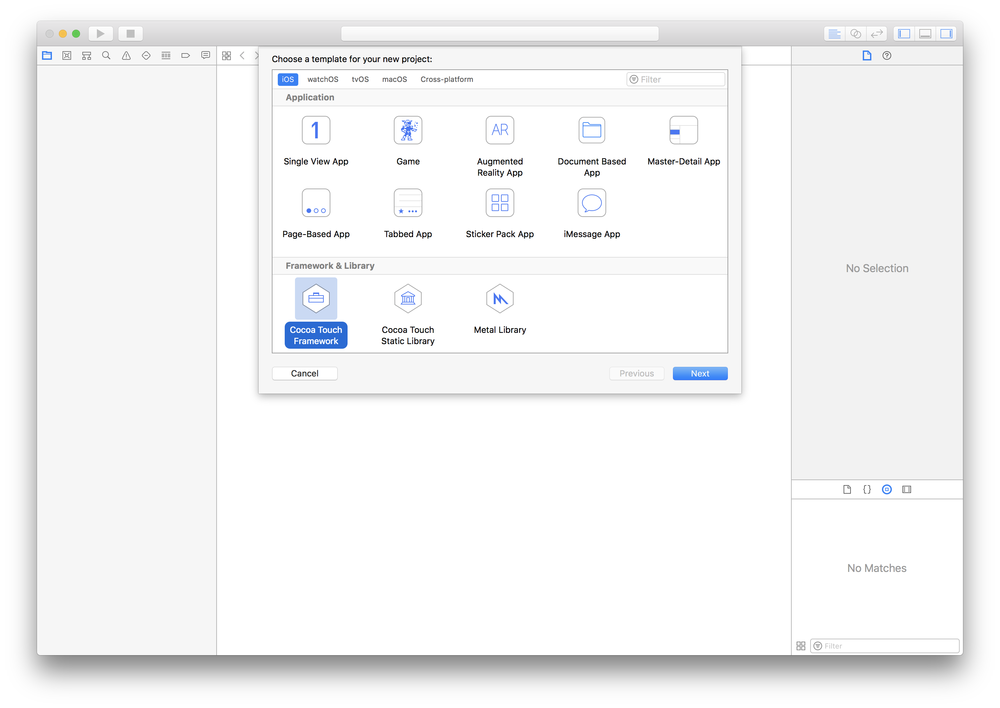

# Xcode 9 制作 iOS 通用 Framework
---

# 创建 Framework
---



## 设置

添加 `.h` `.m` `.swift` 文件


# 模拟器和真机通用 Framework
---

创建*Cross-platform -> Other -> Aggregate* Target。


添加脚本


```bash
# Sets the target folders and the final framework product.
# 如果工程名称和Framework的Target名称不一样的话，要自定义FRAMEWORK_NAME
FRAMEWORK_NAME=${PROJECT_NAME}
# Install dir will be the final output to the framework.
# The following line create it in the root folder of the current project.
INSTALL_DIR=${SRCROOT}/Products/${FRAMEWORK_NAME}.framework
# Working dir will be deleted after the framework creation.
WORKING_DIR=build
DEVICE_DIR=${WORKING_DIR}/Release-iphoneos/${FRAMEWORK_NAME}.framework
SIMULATOR_DIR=${WORKING_DIR}/Release-iphonesimulator/${FRAMEWORK_NAME}.framework
# -configuration ${CONFIGURATION}
# Clean and Building both architectures.
xcodebuild -configuration "Release" -target "${FRAMEWORK_NAME}" -sdk iphoneos clean build
xcodebuild -configuration "Release" -target "${FRAMEWORK_NAME}" -sdk iphonesimulator clean build
# Cleaning the oldest.
if [ -d "${INSTALL_DIR}" ]
then
rm -rf "${INSTALL_DIR}"
fi
mkdir -p "${INSTALL_DIR}"
cp -R "${DEVICE_DIR}/" "${INSTALL_DIR}/"
# Uses the Lipo Tool to merge both binary files ([arm_v7] [i386] [x86_64] [arm64]) into one Universal final product.
lipo -create "${DEVICE_DIR}/${FRAMEWORK_NAME}" "${SIMULATOR_DIR}/${FRAMEWORK_NAME}" -output "${INSTALL_DIR}/${FRAMEWORK_NAME}"
rm -r "${WORKING_DIR}"
open "${INSTALL_DIR}"
```

# Bundle
---

由于默认在 macOS 中使用，需要进行一些其他的设置：

选择 `Bundle`， 在 `Build Settings` 中搜索*base sdk*,选中该行并按下 delete。这样就把 macOS 改为 iOS。

可选 ：搜索*product name*，双击编辑，将内容替换为 和 Framework 名字一样：

默认情况下, 具有两个分辨率的图像可以产生一些有趣的结果。例如, 当你包括视网膜 @2x 版本。他们将合并成一个多分辨率的 TIFF, 这不是一件好事。搜索*hidpi*并将*COMBINE_HIDPI_IMAGES*设置更改为`NO`.

为了确保在 build framework 时一起 build bundle。

要将 bundle 文件与得到的通用 framework 放在同一路径，需要在上面的脚本底部添加：

```
BUNDLE_NAME="bundle name"

# Copy the resources bundle
ditto "${BUILT_PRODUCTS_DIR}/${BUNDLE_NAME}.bundle" \
"${SRCROOT}/Products/${BUNDLE_NAME}.bundle"
```

如果遇到报错提示：

```
ld: -bundle and -bitcode_bundle (Xcode setting ENABLE_BITCODE=YES) cannot be used together
```

需要将 bundle target 的 bitcode 选项设置为 NO：


# 使用 Framework
---

```swift
import RWUIControlsFramework

class ViewController: UIViewController {
    @IBOutlet weak var ribbonView: RWRibbonView!
    @IBOutlet weak var knobControl: RWKnobControl!
    ...
}
```


## 问题

```
dyld: Library not loaded: @rpath/***
  Referenced from: /var/containers/Bundle/Application/38D164D4-FCC7-4A97-9CA9-2FD21E7409ED/ImageViewer.app/ImageViewer
  Reason: image not found
```

将 `framework` 拖入 **Embedded Binaries**


```
Unknown class *** in Interface Builder file.
```

**Interface Builder** 与 源文件建立连接。

<https://gkbrown.org/2017/10/11/creating-a-universal-framework-in-xcode-9/>

> 但是, 包含类似 "fat" 二进制文件的应用程序不会通过**app store**验证。在提交包含通用框架的应用程序之前, 需要剪裁二进制文件, 以便只包含 iOS 本机代码。可以使用以下脚本执行此操作:

```bash
FRAMEWORK=<要剪裁的Framework名称>
echo "Trimming $FRAMEWORK..."

FRAMEWORK_EXECUTABLE_PATH="${BUILT_PRODUCTS_DIR}/${FRAMEWORKS_FOLDER_PATH}/$FRAMEWORK.framework/$FRAMEWORK"

EXTRACTED_ARCHS=()

for ARCH in $ARCHS
do
    echo "Extracting $ARCH..."
    lipo -extract "$ARCH" "$FRAMEWORK_EXECUTABLE_PATH" -o "$FRAMEWORK_EXECUTABLE_PATH-$ARCH"
    EXTRACTED_ARCHS+=("$FRAMEWORK_EXECUTABLE_PATH-$ARCH")
done

echo "Merging binaries..."
lipo -o "$FRAMEWORK_EXECUTABLE_PATH-merged" -create "${EXTRACTED_ARCHS[@]}"
rm "${EXTRACTED_ARCHS[@]}"

rm "$FRAMEWORK_EXECUTABLE_PATH"
mv "$FRAMEWORK_EXECUTABLE_PATH-merged" "$FRAMEWORK_EXECUTABLE_PATH"

echo "Done."
```

源码： <https://github.com/iOSDevLog/1Day1App/tree/develop/code/014.%20UniversalFramework>
